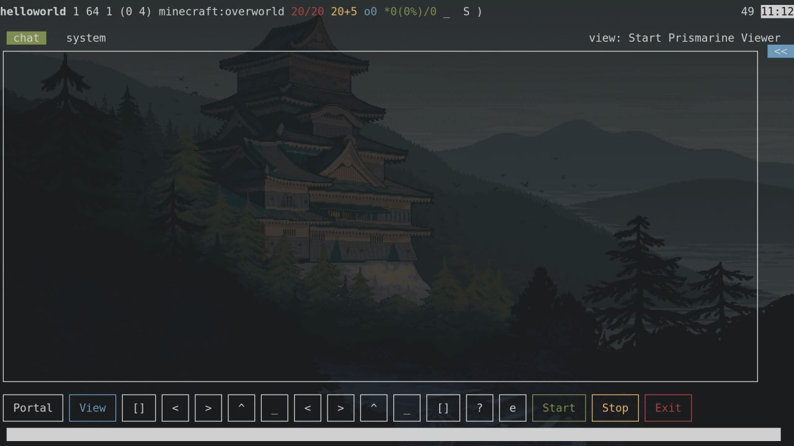

Minechat is minecraft client for chatting without GUI

-   It is a TTY/console/terminal app written with `blessed` (like ncurses) using `mineflayer`
-   Sends notifications via `node-notifier`
-   Uses `mineflayer-pathfinder` to go from hub server to normal world portal
-   Uses `prismarine-viewer` to enable viewer at any time (with right click to move)
-   Uses `mineflayer-web-inventory` to serve inventory preview at any time



## Install

Requires NodeJS 16

```bash
npm i
```

## Configure

```bash
cp .env.example .env
```

Fill `.env`

## Run

Arguments override .env

```bash
./minechat [<host>:<port>] [<name>] [<password>]
```

## Controls

You can navigate around control buttons via arrows (`Ctrl+Up` for input to support command history navigation)

`ESC` to unfocus input
`Ctrl+t` to toggle sidebar
`Shift+PageUp`, `Shift+PageDown` to scroll by page
Mousewheel in messages box to scroll by 3 lines
`Alt+Left`, `Alt+Right`, `Ctrl+Left`, `Ctrl+Right` to switch between tabs (or using mouse)

Also mouse is usable even in TTY (with GPM (General Purpose Mouse))

-   `Portal` is used to go to configured start point
-   `View` starts Prismarine Viewer on specified port
-   `[]` serves Web inventory
-   `<`, `>`, `^`, `_` used to rotate camera (look)
-   next `<`, `>`, `^`, `_` used to move (toggles state)
-   `[]` shows popup with inventory
-   `?` shows popup with game info
-   `e` prints names and coords of entities around
-   `Start`, `Stop` to connect, disconnect to/from server only
-   `Exit` to close app
-   Input is to write to chat (`Up`, `Down` keys for history, `Tab` for completion)

## Top bar

In top bar showed on left side:

-   Nickname
-   `x y z (yaw pitch)` (coords + horizontal and vertical view angles respectively)
-   current world
-   Health (red)
-   Food + Saturation (yellow)
-   Oxygen Level (blue)
-   Experience level (percent of level) / total exp points (green)
-   `_` if standing on ground `|` otherwise
-   `R` if rainy `S` if sunny
-   `O` shows current moon state
-   Sometimes: `~` - in water, `=` - in lava, `#` in web

On right side:

-   Ping
-   Realistic time (day from 6:00 to 18:00). White when day, dark on night

## Sidebar

Sidebar shows current online and collapsibale via `>>`

## Tabs

Chat streams splitted into tabs to separate players chat from system info

To the right of tab title located status bar that shows game info (e.g. `1/2 players sleeping`)

## Bugs

-   If modal opened when input focused inserted input doubled
